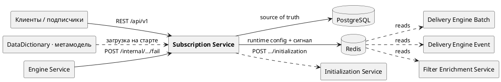

# Subscription Service

Control-plane управления подписками на поток объектов. Сервис предоставляет REST API для создания,
просмотра, приостановки, возобновления, удаления подписок и запуска initialization. **PostgreSQL** —
единственный Source Of Truth конфигурации; в **Redis** сервис публикует runtime-конфигурацию, которую
читают delivery-движки (`delivery-engine-batch`, `delivery-engine-event`) и filter-enrichment. Сам
сервис Kafka-поток **не** обрабатывает, RSQL не компилирует и объекты не доставляет — это работа
движков.



Место в системе: Subscription Service — **единственный писатель** контракта конфигурации в Redis
(`sub:{id}`, `subs:runtime`, канал `subscriptions:changes`). Движки этот контракт только читают и
никогда не пишут; при недоступности исходного объекта или ошибке компиляции фильтра движок сообщает об
этом обратно через внутренний `POST /internal/subscriptions/{id}/fail`.

## Ключевые свойства

- **Immutable-конфигурация.** `filter`, `fields`, `engine`, `topicPostfix`, `targets` после создания не
  меняются: любое изменение клиент моделирует как новую подписку с новым id. Со временем меняется
  только `status` (и диагностика FAILED).
- **Redis — обязательная часть write-path.** Любая операция изменения конфигурации выполняется в одной
  транзакции, пишущей и в PostgreSQL, и в Redis. При недоступности Redis выбрасывается
  `RedisUnavailableException`, транзакция PostgreSQL откатывается, клиент получает **HTTP 503**, а
  подписка не считается изменённой. Read-операции при недоступности Redis продолжают работать.
- **Fail-fast по метамодели.** Метамодель DataDictionary загружается один раз на старте; если её не
  удалось загрузить, приложение не поднимается. По метамодели валидируются `targets`, `fields` и
  селекторы `filter` (полиморфные / мульти-класс таргеты).

## Стек

Java 17, Spring Boot 3.3.5, Spring Web, Spring Data JPA, Spring Data Redis, Bean Validation, Actuator,
springdoc-openapi, PostgreSQL + **Liquibase**, Maven. Тесты — JUnit/Mockito + H2.

## Быстрый старт

```bash
docker compose up -d          # PostgreSQL + Redis (см. docker-compose.yml)
mvn spring-boot:run           # сервис на :8080
```

Кроме PostgreSQL и Redis для старта нужен доступный **DataDictionary** с загруженной метамоделью (см.
соседний проект `DataDictionary`). Основные env: `DB_URL`, `DB_USER`, `DB_PASSWORD`, `REDIS_HOST`,
`REDIS_PORT`, `DATA_DICTIONARY_URL`, `INIT_SERVICE_URL` — полный справочник в
[docs/configuration.md](docs/configuration.md).

## Пример

```bash
curl -X POST http://localhost:8080/api/v1/subscribers/risk-service/subscriptions \
  -H 'Content-Type: application/json' \
  -d '{"topicPostfix":"prod",
       "targets":[{"objectClass":"FxSpotForwardTrade","includeSubclasses":true}],
       "fields":["Trade.portfolioId","FxSpotForwardTrade.baseCurrency.code"],
       "filter":"Trade.portfolioId==P1","engine":"EVENT_WITH_REMOVE"}'
```

Ответ (201) содержит `subscriptionId`, вычисленное имя топика `subscription.risk-service.prod`,
`status: ACTIVE` и эхо конфигурации. Параллельно сервис пишет `sub:{id}` в Redis, добавляет id в
`subs:runtime` и публикует `CONFIG_CHANGED` в канал `subscriptions:changes`.

## Документация

| Документ | О чём |
|---|---|
| [docs/architecture.md](docs/architecture.md) | Место в системе, компоненты (реальные классы/пакеты), поток создания подписки, связь с движками через Redis, транзакционный write-path |
| [docs/api.md](docs/api.md) | REST API справочник: публичные эндпоинты, DTO, коды ошибок, примеры JSON + внутренний `/internal/.../fail` |
| [docs/redis-contract.md](docs/redis-contract.md) | **Контракт Redis** для движков: ключи `sub:{id}`, `subs:runtime`, канал `subscriptions:changes`, форма JSON, жизненный цикл статусов |
| [docs/data-model.md](docs/data-model.md) | Схема PostgreSQL по Liquibase (таблицы, колонки, индексы, связи), engine-типы и статусы |
| [docs/configuration.md](docs/configuration.md) | Полный справочник настроек `subscription.*`, `spring.*`, `management.*` и переменных окружения |
| [docs/operations.md](docs/operations.md) | Runbook: health-пробы, миграции Liquibase, зависимости, таблица «симптом → причина → что проверить», деплой |

## OpenAPI / Swagger

Документируется только публичный API (`/api/v1/**`); внутренний `/internal/**` в спеку не попадает.

- OpenAPI JSON: `GET /v3/api-docs`
- Swagger UI: `GET /swagger-ui.html`

## Тесты

```bash
mvn test
```

Юнит-тесты сервиса/квот/валидации (Mockito), web-слой (`@WebMvcTest`), слой репозитория
(`@DataJpaTest` на H2) и разбор метамодели — Docker не требуется.
