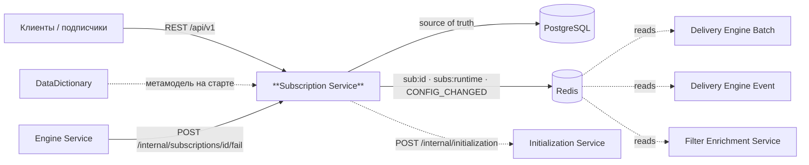
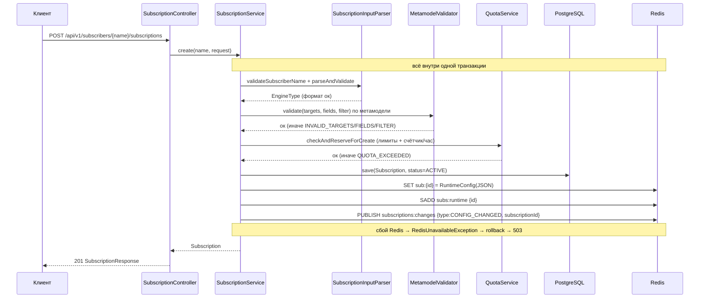
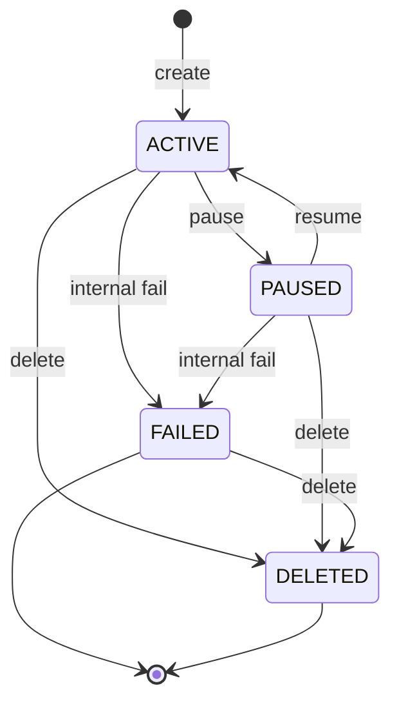

# Архитектура

## Место в системе

Subscription Service — control-plane. Он хранит конфигурацию подписок в PostgreSQL (единственный Source
Of Truth) и публикует её runtime-представление в Redis. Delivery-движки и filter-enrichment — это
**отдельные сервисы** (свои git, CI/CD, релизные циклы); они читают контракт из Redis и никогда в него
не пишут. Сам Subscription Service Kafka не касается, RSQL не компилирует и объекты не доставляет.

## Компоненты

| Пакет | Компонент | Ответственность |
|---|---|---|
| `api` | `SubscriptionController` | Публичный REST API в namespace `/api/v1/subscribers/{subscriberName}/subscriptions` |
| `api` | `InternalSubscriptionController` | Внутренний `POST /internal/subscriptions/{id}/fail` для Engine Service |
| `api.dto` | `CreateSubscriptionRequest`, `SubscriptionResponse`, `ResumeRequest`, `FailRequest` | Контракты запросов/ответов (records) |
| `api.error` | `GlobalExceptionHandler`, `ErrorCode`, `ErrorResponse` | Единый формат ошибки `{code,message,details}` и маппинг на HTTP |
| `service` | `SubscriptionService` | Оркестрация жизненного цикла; транзакционный write-path (PostgreSQL + Redis) |
| `service` | `SubscriptionInputParser` | Структурная валидация формата (subscriberName, topicPostfix, targets, fields, engine) |
| `service` | `QuotaService` | Конфигурируемые лимиты/квоты (статические + почасовые счётчики) |
| `service` | `TopicNameResolver` | Вычисление имени топика `subscription.{subscriberName}.{topicPostfix}` |
| `service.runtime` | `RuntimeConfigStore` / `RedisRuntimeConfigStore` | Запись/удаление `sub:{id}` и членства в `subs:runtime` |
| `service.runtime` | `ConfigChangePublisher` / `RedisConfigChangePublisher` | Публикация `CONFIG_CHANGED` в канал `subscriptions:changes` |
| `service.runtime` | `RateCounterStore` / `RedisRateCounterStore` | Почасовые счётчики квот в Redis с TTL |
| `service.runtime` | `RuntimeConfig` | Payload для `sub:{id}` (форма JSON контракта) |
| `service.validation` | `SubscriptionValidator`, `MetamodelSubscriptionValidator` | Семантическая валидация targets/fields/filter по метамодели |
| `service.validation.metamodel` | `MetamodelCatalog(Holder/Factory)`, `HttpMetamodelClient`, `FilterFieldExtractor` | Загрузка метамодели DataDictionary, иерархия классов, извлечение селекторов из RSQL |
| `service.client` | `InitializationClient` / `HttpInitializationClient` | Вызов Initialization Service |
| `domain` | `Subscription`, `SubscriptionTarget`, `EngineType`, `SubscriptionStatus` | JPA-сущность и доменные перечисления |
| `repository` | `SubscriptionRepository`, `SubscriptionSpecifications` | Доступ к БД и динамические предикаты листинга |
| `config` | `SubscriptionProperties`, `OpenApiConfig` | Внешняя конфигурация и метаданные OpenAPI |

> Активный бин валидатора — `MetamodelSubscriptionValidator`. `StubSubscriptionValidator` (no-op) не
> регистрируется как Spring-бин и используется только как тестовый дублёр / резервный вариант.

## Транзакционный write-path

Каждая операция изменения конфигурации выполняется в одной `@Transactional`-транзакции, которая пишет и
в PostgreSQL, и в Redis. Redis — **обязательная** часть write-path: если запись/публикация в Redis
падает (`DataAccessException`), выбрасывается `RedisUnavailableException`, транзакция PostgreSQL
откатывается, клиент получает **HTTP 503**, и два хранилища не расходятся. Read-операции (`GET`,
листинг) от Redis не зависят.

Runtime-конфигурация хранится только для подписок в runtime-статусе (`ACTIVE` или `PAUSED`,
`SubscriptionStatus.isRuntime()`). Переход в `FAILED`/`DELETED` удаляет `sub:{id}` и снимает id с
`subs:runtime`, но всегда сопровождается сигналом `CONFIG_CHANGED`, чтобы движки перечитали состояние.

## Поток создания подписки

Порядок валидаций в `create`: формат (`SubscriptionInputParser`) → семантика по метамодели
(`MetamodelSubscriptionValidator`) → квоты (`QuotaService`) → PostgreSQL → Redis → `CONFIG_CHANGED`.
Почасовой счётчик создания инкрементируется последним, чтобы отказ по статическому лимиту не расходовал
часовой бюджет.

## Жизненный цикл и связь с движками

- **pause** `ACTIVE → PAUSED`, **resume** `PAUSED → ACTIVE` — обе операции переписывают `sub:{id}`
  (статус в payload меняется) и шлют `CONFIG_CHANGED`. Обе идемпотентны. При `resume` с
  `runInitialization=true` дополнительно вызывается Initialization Service.
- **delete** `ACTIVE/PAUSED/FAILED → DELETED` — удаляет `sub:{id}`, снимает id с `subs:runtime`,
  публикует `CONFIG_CHANGED`. Идемпотентна. Kafka-топик **не** удаляется.
- **fail** (внутренний, `POST /internal/subscriptions/{id}/fail`) — Engine Service переводит подписку в
  `FAILED`, когда её фильтр перестал компилироваться после изменения модели. Удаляет из runtime,
  сохраняет `failureReason`/`failureMessage`, публикует `CONFIG_CHANGED`.

Движки узнают об изменениях по сигналу `CONFIG_CHANGED` (в нём только `subscriptionId` — это сигнал, а
не данные) и перечитывают `sub:{id}` из Redis. Полный контракт — в [redis-contract.md](redis-contract.md).

## Метамодель и валидация

`MetamodelCatalogHolder` при старте (fail-fast) грузит метамодель из DataDictionary одним запросом
`GET /api/search-service/metadata/v3` (классы `name`↔`sourceValue`, объявленные скалярные поля,
иерархия `parentsOrSelf`, связи `relations`). `MetamodelSubscriptionValidator` проверяет:

- каждый `objectClass` таргета резолвится в известный класс (иначе `INVALID_TARGETS`);
- каждое поле в `fields` и каждый селектор `Class.field`, извлечённый из `filter`
  (`FilterFieldExtractor`), резолвится по метамодели (иначе `INVALID_FIELDS` / `INVALID_FILTER`);
- ведущий класс поля применим хотя бы к одному таргету: для полиморфного (`includeSubclasses=true`)
  таргета допустимы предок, сам класс или подтип; для точного — только предок-или-сам.

RSQL здесь **не** компилируется — из фильтра лишь лексически извлекаются селекторы `Class.field`;
компиляция фильтра остаётся работой Engine Service.

См. также: [API](api.md) · [контракт Redis](redis-contract.md) · [модель данных](data-model.md) · [конфигурация](configuration.md) · [эксплуатация](operations.md)
