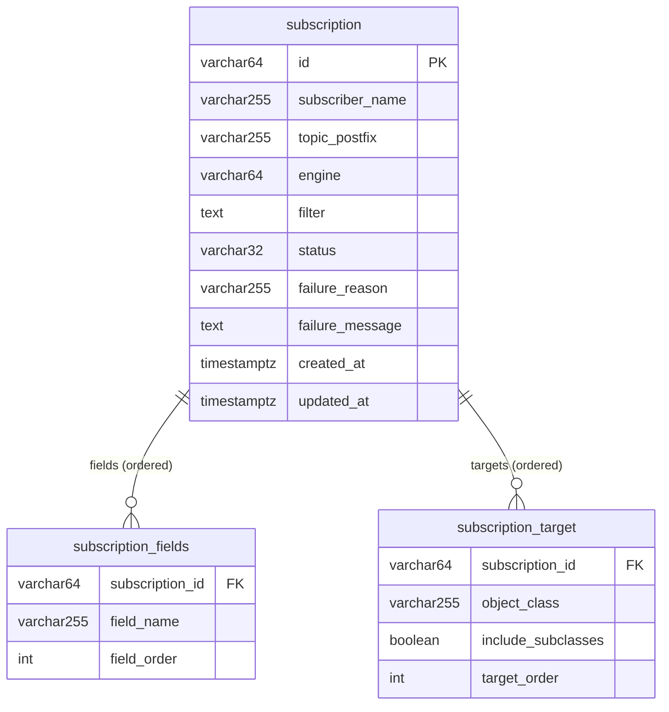

# Модель данных

PostgreSQL — единственный Source Of Truth конфигурации подписок. Схема управляется **Liquibase**
(`spring.liquibase.change-log = classpath:db/changelog/db.changelog-master.yaml`); JPA работает в режиме
`ddl-auto: validate` и схему не создаёт. Мастер-changelog подключает два набора изменений:

- `changes/001-initial-schema.yaml` — таблицы `subscription`, `subscription_fields` и индексы (перенос
  бывшего Flyway `V1__init.sql`);
- `changes/002-subscription-target.yaml` — таблица `subscription_target` (мульти-класс таргеты).

## Схема

## Таблица `subscription`

Одна строка на подписку. Конфигурация иммутабельна — изменяются только `status` и диагностика FAILED.

| Колонка | Тип | Ограничения | Примечания |
|---|---|---|---|
| `id` | varchar(64) | PK (`pk_subscription`) | `sub-{uuid}` |
| `subscriber_name` | varchar(255) | not null | Владелец; часть имени топика |
| `topic_postfix` | varchar(255) | not null | Постфикс топика |
| `engine` | varchar(64) | not null | `EngineType` (enum как строка) |
| `filter` | text | — | RSQL-фильтр (может быть null) |
| `status` | varchar(32) | not null | `SubscriptionStatus` (enum как строка) |
| `failure_reason` | varchar(255) | — | Заполняется при переходе в `FAILED` |
| `failure_message` | text | — | Заполняется при переходе в `FAILED` |
| `created_at` | timestamptz | not null | Проставляется `@PrePersist` |
| `updated_at` | timestamptz | not null | Обновляется `@PreUpdate` |

Колонки `id`, `subscriber_name`, `topic_postfix`, `engine`, `filter` в JPA помечены `updatable=false`
(отражает иммутабельность конфигурации). Hibernate работает в UTC (`hibernate.jdbc.time_zone: UTC`).

Индексы:

| Индекс | Колонки | Назначение |
|---|---|---|
| `idx_subscription_subscriber` | `subscriber_name` | Выборки по подписчику |
| `idx_subscription_subscriber_status` | `subscriber_name, status` | Листинг с фильтром по статусу |
| `idx_subscription_subscriber_topic` | `subscriber_name, topic_postfix` | Проверки квоты топиков / фильтр по постфиксу |

## Таблица `subscription_fields`

Упорядоченный список возвращаемых полей (`@ElementCollection` + `@OrderColumn`).

| Колонка | Тип | Ограничения |
|---|---|---|
| `subscription_id` | varchar(64) | FK → `subscription(id)`, `ON DELETE CASCADE` |
| `field_name` | varchar(255) | not null |
| `field_order` | int | not null |

Первичный ключ — составной `(subscription_id, field_order)` (`pk_subscription_fields`).

## Таблица `subscription_target`

Упорядоченный список классов-целей подписки (мультикласс); `@Embeddable SubscriptionTarget`.

| Колонка | Тип | Ограничения | Примечания |
|---|---|---|---|
| `subscription_id` | varchar(64) | FK → `subscription(id)`, `ON DELETE CASCADE` | |
| `object_class` | varchar(255) | not null | Класс объекта (`sourceValue` метамодели) |
| `include_subclasses` | boolean | not null, default `true` | `true` — полиморфно (класс + наследники); `false` — точный класс |
| `target_order` | int | not null | |

Первичный ключ — составной `(subscription_id, target_order)` (`pk_subscription_target`). Индекс
`idx_subscription_target_class` по `object_class`.

## Engine-типы (`EngineType`)

Сервис только хранит выбранный движок; логика обработки — в delivery-движках. Значение попадает в
`sub:{id}.engine`, и каждый движок обслуживает подписки своего типа.

| Значение | Смысл |
|---|---|
| `OBJECT_STREAM` | Потоковая доставка объектов (без предыдущей ревизии) |
| `OBJECT_WITH_PREVIOUS` | Доставка объектов с приложенной предыдущей ревизией |
| `EVENT_WITH_REMOVE` | Событийная доставка: `PUT` при попадании в выборку и явный `REMOVE` при выходе из неё (обслуживает `delivery-engine-event`) |
| `OBJECT_BATCH` | Пакетная доставка (обслуживает `delivery-engine-batch`) |

## Статусы (`SubscriptionStatus`)

| Значение | В Redis (`isRuntime()`) | Примечания |
|---|---|---|
| `ACTIVE` | да | Рабочее состояние; создаётся сразу в нём |
| `PAUSED` | да | Приостановлена; остаётся в runtime с `status:PAUSED` |
| `FAILED` | нет | Переведена Engine-сервисом (фильтр перестал компилироваться); хранит `failure_reason`/`failure_message` |
| `DELETED` | нет | Логическое удаление; строка сохраняется, топик не удаляется |

`isRuntime()` = `ACTIVE || PAUSED` — критерий присутствия в Redis-контракте (см.
[redis-contract.md](redis-contract.md)).

## Метамодель (внешний источник, не в БД)

Классы, поля, иерархия и связи, по которым валидируются `targets`/`fields`/`filter`, не хранятся в
PostgreSQL — они грузятся из DataDictionary в память на старте
(`GET /api/search-service/metadata/v3`, `MetamodelCatalog`). Из ответа используются: `classes`
(`name` ↔ `sourceValue`), `fields.declaredFields`, `hierarchy.parentsOrSelf`, `relations`
(`alias`/`name` → `targetClass`).

См. также: [архитектура](architecture.md) · [контракт Redis](redis-contract.md) · [API](api.md) · [эксплуатация](operations.md)
