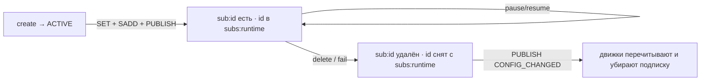

# Контракт Redis

Redis — это интерфейс, через который Subscription Service (control-plane) отдаёт runtime-конфигурацию
delivery-движкам и filter-enrichment. Subscription Service — **единственный писатель** этого контракта;
движки его только читают. Это стабильный публичный интерфейс сервиса — любое изменение формы ключей или
JSON считается breaking.

## Ключи и структуры

| Ключ | Тип Redis | Смысл |
|---|---|---|
| `sub:{subscriptionId}` | String (JSON) | Runtime-конфигурация одной подписки. Присутствует только для подписок в статусе `ACTIVE` или `PAUSED` |
| `subs:runtime` | Set | Множество id всех runtime-подписок (`ACTIVE`/`PAUSED`) |
| канал `subscriptions:changes` | Pub/Sub | Сигнал об изменении: `{ "type":"CONFIG_CHANGED", "subscriptionId":"…" }` |
| `quota:{subscriberName}:{action}:{hourBucket}` | String (счётчик) | Внутренние почасовые счётчики квот с TTL 1 час; **не** часть контракта для движков |

Имена ключей конфигурируемы (`subscription.redis.*`, см. [конфигурацию](configuration.md)); значения по
умолчанию — `sub:`, `subs:runtime`, `subscriptions:changes`.

## Форма `sub:{id}` (JSON)

Значение — сериализованный `RuntimeConfig`. Поля соответствуют компонентам record 1:1:

| Поле | Тип | Примечания |
|---|---|---|
| `subscriptionId` | string | id подписки (`sub-{uuid}`) |
| `subscriberName` | string | Имя подписчика |
| `topic` | string | Полное имя топика `subscription.{subscriberName}.{topicPostfix}` |
| `engine` | string | `OBJECT_STREAM` / `OBJECT_WITH_PREVIOUS` / `EVENT_WITH_REMOVE` / `OBJECT_BATCH` |
| `targets` | object[] | Классы-цели: `{ objectClass, includeSubclasses }` |
| `fields` | string[] | Возвращаемые поля объекта |
| `filter` | string / null | RSQL-фильтр (может отсутствовать) |
| `status` | string | `ACTIVE` или `PAUSED` (`FAILED`/`DELETED` в Redis не хранятся) |

```json
{
  "subscriptionId": "sub-fc78797d-888f-447d-9c63-e24ea9a0aaa0",
  "subscriberName": "risk-service",
  "topic": "subscription.risk-service.prod",
  "engine": "EVENT_WITH_REMOVE",
  "targets": [
    { "objectClass": "FxSpotForwardTrade", "includeSubclasses": true }
  ],
  "fields": ["Trade.portfolioId", "FxSpotForwardTrade.baseCurrency.code"],
  "filter": "Trade.portfolioId==P1",
  "status": "ACTIVE"
}
```

> `status` в payload может быть `PAUSED`: приостановленная подписка остаётся в Redis (движок сам решает
> не доставлять по ней), а из `subs:runtime` id снимается только при `FAILED`/`DELETED`.

## Сигнал `CONFIG_CHANGED`

При каждом изменении, затрагивающем runtime, сервис публикует в канал `subscriptions:changes`:

```json
{ "type": "CONFIG_CHANGED", "subscriptionId": "sub-fc78797d-888f-447d-9c63-e24ea9a0aaa0" }
```

Это **сигнал, а не данные**: он несёт только `subscriptionId`. Движок в ответ должен перечитать
`sub:{id}` из Redis и по результату обновить локальное представление:

- ключ `sub:{id}` есть → взять актуальную конфигурацию (учесть `status`);
- ключа нет → подписка вышла из runtime (`FAILED`/`DELETED`), убрать её из локального registry.

## Запись — атомарность с PostgreSQL

Все записи в Redis выполняются внутри той же транзакции, что и запись в PostgreSQL (`SubscriptionService`).
Redis — обязательная часть write-path: при `DataAccessException` бросается `RedisUnavailableException`,
транзакция PostgreSQL откатывается, клиент получает `503`. Так исходное хранилище и Redis не расходятся
на неуспешной операции.

| Операция | Действия в Redis |
|---|---|
| create | `SET sub:{id}` · `SADD subs:runtime {id}` · `PUBLISH CONFIG_CHANGED` |
| pause / resume | `SET sub:{id}` (обновлённый `status`) · `SADD subs:runtime {id}` · `PUBLISH CONFIG_CHANGED` |
| delete | `DEL sub:{id}` · `SREM subs:runtime {id}` · `PUBLISH CONFIG_CHANGED` |
| fail (internal) | `DEL sub:{id}` · `SREM subs:runtime {id}` · `PUBLISH CONFIG_CHANGED` |

## Жизненный цикл статусов в Redis



| Статус (`SubscriptionStatus`) | `sub:{id}` | Членство в `subs:runtime` |
|---|---|---|
| `ACTIVE` | есть (`status:ACTIVE`) | есть |
| `PAUSED` | есть (`status:PAUSED`) | есть |
| `FAILED` | удалён | снят |
| `DELETED` | удалён | снят |

`SubscriptionStatus.isRuntime()` (`ACTIVE || PAUSED`) — критерий присутствия в Redis.

## Как движки потребляют контракт

Типовой цикл движка (реализация — в самих движках, здесь описан ожидаемый способ чтения):

1. На старте прочитать `subs:runtime` и для каждого id загрузить `sub:{id}`, собрав локальный registry.
2. Подписаться на канал `subscriptions:changes`.
3. На каждый `CONFIG_CHANGED` перечитать `sub:{subscriptionId}`; обновить или удалить запись в registry.
4. Обслуживать только подписки своего типа движка (по полю `engine`) и в подходящем статусе.

См. также: [архитектура](architecture.md) · [модель данных](data-model.md) · [API](api.md) · [конфигурация](configuration.md)
